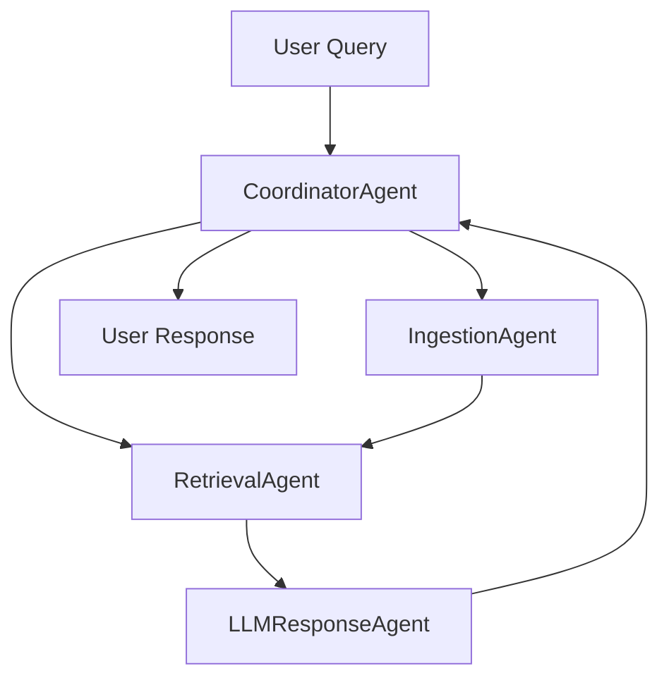

# Agentic RAG Chatbot with Model Context Protocol (MCP)

A multi-agent Retrieval-Augmented Generation (RAG) chatbot that processes documents in various formats and answers user queries using an agentic architecture with Model Context Protocol for inter-agent communication.

## 🏗️ Architecture Overview

The system consists of 4 main agents communicating via MCP:

* **IngestionAgent** : Parses and preprocesses documents (PDF, DOCX, PPTX, CSV, TXT)
* **RetrievalAgent** : Handles embedding generation and semantic search using FAISS
* **LLMResponseAgent** : Generates responses using Google Gemini API
* **CoordinatorAgent** : Orchestrates the entire workflow

## 🚀 Features

* **Multi-format Document Support** : PDF, DOCX, PPTX, CSV, TXT/Markdown
* **Agentic Architecture** : 4 specialized agents with MCP communication
* **Vector Search** : FAISS-based semantic search with sentence transformers
* **LLM Integration** : Google Gemini for response generation
* **Persistent Storage** : Vector index and metadata persistence

## 📋 Prerequisites

* Python 3.8+
* Google API Key for Gemini
* At least 2GB RAM for vector operations

## 🛠️ Installation

### 1. Clone the Repository

```bash
git clone <your-repo-url>
cd agentic-rag-chatbot
```

### 2. Create Virtual Environment

```bash
python -m venv venv
source venv/bin/activate  # On Windows: venv\Scripts\activate
```

### 3. Install Dependencies

```bash
pip install -r requirements.txt
```

### 4. Set Up API Keys

Create a `.env` file in the root directory:

```env
GOOGLE_API_KEY=your_google_api_key_here
```

## 📦 Dependencies

Create a `requirements.txt` file with:

```txt
faiss-cpu==1.7.4
sentence-transformers==2.2.2
numpy==1.24.3
pandas==2.0.3
python-docx==0.8.11
python-pptx==0.6.21
PyPDF2==3.0.1
google-generativeai==0.3.2
streamlit==1.28.1
python-dotenv==1.0.0
```

## 🏃‍♂️ Quick Start

### Launch the Streamlit Application

```bash
streamlit run app.py
```

The application will open in your browser at `http://localhost:8501`

### Using the Interface

1. **Upload Documents** : Use the sidebar "Upload" tab to add PDF, DOCX, PPTX, CSV, or TXT files
2. **Ask Questions** : Type your questions in the chat input at the bottom
3. **View Logs** : Check the "Logs" tab in the sidebar to see MCP message flow
4. **Multi-turn Conversations** : Continue asking follow-up questions about your documents

## 📁 Project Structure

```
project/
├── agents/
│   ├── __init__.py
│   ├── coordinator_agent.py      # Orchestrates workflow
│   ├── ingestion_agent.py        # Document parsing
│   ├── retrieval_agent.py        # Vector search
│   └── llm_response_agent.py     # LLM response generation
├── mcp/
│   ├── __init__.py
│   ├── message_protocol.py       # MCP message definitions
│   └── messageBus.py            # Message bus implementation
├── documentParsers/
│   ├── __init__.py
│   └── parsers.py               # Multi-format parsers
├── vectorStore/
│   ├── __init__.py
│   └── faissStore.py            # FAISS vector store
├── ui/
│   ├── __init__.py
│   └── app.py                   # Main Streamlit application
├── vectorDB/                    # Generated vector indices
├── requirements.txt
├── .env                         # Environment variables
└── README.md
```

## 🔧 Configuration

### Vector Store Configuration

```python
# In vectorStore/faissStore.py
FaissStore(
    dim=384,                           # Embedding dimension
    indexPath="vectorDB/index.faiss",  # Index file path
    metaPath="vectorDB/meta.json",     # Metadata file path
    modelName="intfloat/e5-small-v2"   # Sentence transformer model
)
```

### Document Parsing Configuration

```python
# In documentParsers/parsers.py
CHUNK_SIZE = 500  # Characters per chunk
```

## 🎯 Usage Examples

### Example 1: Using the Streamlit Interface

1. **Start the application:**
   ```bash
   streamlit run app.py
   ```
2. **Upload documents:**
   * Click on the "Upload" tab in the sidebar
   * Select your PDF, DOCX, PPTX, CSV, or TXT files
   * Click "Add to Knowledge Base"
3. **Ask questions:**
   * Type your question in the chat input
   * Example: "What are the key findings in the research paper?"
   * View the response with source context

### Example 2: Multi-turn Conversation

```
User: "What is this document about?"
Bot: "This document discusses machine learning algorithms..."

User: "Can you summarize the main conclusions?"
Bot: "The main conclusions are: 1) Deep learning shows..."
```

### Example 3: Document Types

* **PDF** : Research papers, reports, manuals
* **DOCX** : Word documents, proposals, contracts
* **PPTX** : Presentations, slide decks
* **CSV** : Data tables, spreadsheets
* **TXT/MD** : Plain text files, documentation

## 📊 MCP Message Flow



### Sample MCP Messages

**Ingestion Result:**

```json
{
  "sender": "IngestionAgent",
  "receiver": "RetrievalAgent",
  "type": "INGESTION_RESULT",
  "trace_id": "abc-123",
  "payload": {
    "chunks": ["chunk1", "chunk2"],
    "source": "document.pdf"
  }
}
```

**Retrieval Result:**

```json
{
  "sender": "RetrievalAgent",
  "receiver": "LLMResponseAgent",
  "type": "RETRIEVAL_RESULT",
  "trace_id": "abc-123",
  "payload": {
    "retrieved_context": ["relevant chunk 1", "relevant chunk 2"],
    "query": "What are the KPIs?"
  }
}
```

## 🐛 Troubleshooting

### Common Issues

1. **FAISS Installation Issues**
   ```bash
   pip install faiss-cpu --no-cache-dir
   ```
2. **Google API Key Issues**
   * Ensure your API key is valid
   * Check quota limits
   * Verify the key is set in environment variables
3. **Memory Issues**
   * Reduce chunk size in `parsers.py`
   * Use smaller embedding models
   * Process documents in batches
4. **File Parsing Issues**
   * Ensure documents are not corrupted
   * Check file permissions
   * Verify file formats are supported

### Debug Mode

Enable debug logging by adding:

```python
import logging
logging.basicConfig(level=logging.DEBUG)
```

## 🔬 Testing

### Unit Tests

```bash
# Test document parser
python -m project.documentParsers.parsers

# Test vector store
python -m project.vectorStore.faissStore
```

### Integration Tests

```python
# Test full workflow
python test_integration.py
```

## 🚀 Deployment

### Local Development

```bash
streamlit run app.py --server.port 8501
```

### Docker Deployment

```dockerfile
FROM python:3.9-slim
COPY . /app
WORKDIR /app
RUN pip install -r requirements.txt
CMD ["streamlit", "run", "app.py", "--server.port=8501", "--server.address=0.0.0.0"]
```

## 📈 Performance Optimization

* **Embedding Caching** : Store embeddings for frequently accessed documents
* **Async Processing** : Use async/await for concurrent operations
* **GPU Acceleration** : Use `faiss-gpu` for better performance
* **Batch Processing** : Process multiple documents simultaneously

## 🔐 Security Considerations

* Store API keys in environment variables
* Implement input validation for file uploads
* Add rate limiting for API calls
* Sanitize user inputs

## 🤝 Contributing

1. Fork the repository
2. Create a feature branch
3. Make your changes
4. Add tests
5. Submit a pull request

## 📄 License

This project is licensed under the MIT License - see the LICENSE file for details.

## 🙏 Acknowledgments

* FAISS for vector similarity search
* Sentence Transformers for embeddings
* Google Gemini for LLM capabilities
* Streamlit for the web interface

## 📞 Support

For issues and questions:

* Create an issue in the GitHub repository
* Check the troubleshooting section
* Review the MCP message flow for debugging

---

 **Note** : Remember to replace <[ayushkum1310/Slris-Project: Keep Husteling](https://github.com/ayushkum1310/Slris-Project)> with your actual repository URL and add your specific API keys to the `.env` file.
